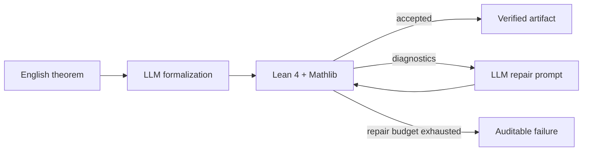

# Verified Mathematical Reasoning
### Autoformalization and iterative proof repair with Lean 4

[](#requirements)
[](https://lean-lang.org/)
[](#project-status)

> Language models propose mathematical formalizations and proofs. **Lean decides
> whether they are valid.** This repository is a compact, auditable framework
> for measuring that gap and using compiler feedback to close it.

## Why this project?

Natural-language mathematics is ambiguous; proof-assistant code is not. A model
can produce an answer that sounds plausible while being ill-typed, incomplete,
or logically incorrect. This project treats Lean as the sole verifier and asks a
focused research question:

> Can Lean diagnostics help a language model turn an invalid generated theorem
> into a checked proof within a small, fixed repair budget?



## At a glance

| Component | Current implementation |
| --- | --- |
| Proof assistant | Lean 4 with Mathlib imports |
| Benchmark format | Human-readable JSONL |
| Examples | 4 elementary theorems |
| Dataset split | 2 development / 2 held-out test |
| Domains | Natural numbers, integers, reals, and sets |
| Repair budget | Configurable; default: 3 retries |
| LLM coupling | Provider-neutral `TextGenerator` protocol |
| Evidence of validity | Lean process exit status, diagnostics, and elapsed time |
| Automated checks | 5 unit tests |

The benchmark is intentionally small at this stage: it validates the full
experimental pipeline before scaling to a larger corpus. It is **not** a claim
of model performance.

## Benchmark snapshot

| ID | Split | Area | Natural-language goal |
| --- | --- | --- | --- |
| `nat_add_zero` | dev | arithmetic | Adding zero to a natural number changes nothing. |
| `even_square` | dev | algebra | The square of an even integer is even. |
| `zero_mul` | test | algebra | Zero times a real number is zero. |
| `subset_refl` | test | sets | Every set is a subset of itself. |

Each record contains an identifier, split, English statement, reference Lean
declaration, and tags. The reference declaration supports qualitative review;
it is never silently substituted for a model-generated proof.

## What is measured?

The evaluator keeps example-level outcomes separate from raw attempt counts:

| Metric | Definition | Why it matters |
| --- | --- | --- |
| Initial success rate | Examples accepted on the first Lean check / all examples | Measures one-shot generation quality. |
| Eventual success rate | Examples accepted in any allowed round / all examples | Measures the combined generation-and-repair system. |
| Repaired successes | Eventual successes minus initial successes | Isolates value added by compiler feedback. |
| Attempts per example | Generated/check rounds per theorem | Reveals the cost of repair. |
| Diagnostics | Lean stdout/stderr per rejected attempt | Makes errors inspectable and reproducible. |
| Verification time | Wall-clock check time per attempt | Enables latency reporting. |

An accepted theorem means Lean returned a successful exit status. Sources
containing `sorry` or `admit` are rejected before invoking Lean.

## Repository layout

```text
data/benchmark.jsonl          Curated theorem records
examples/zero_mul.lean        A standalone Lean example
src/proof_repair/
  benchmark.py                JSONL loading and validation
  generation.py               Prompts and model-provider interface
  verifier.py                 Isolated Lean subprocess checker
  repair.py                   Bounded compiler-feedback repair loop
  evaluation.py               JSONL artifacts and aggregate metrics
  cli.py                      Benchmark inspection and Lean checking
tests/                        Pipeline behavior tests
```

## Quick start

### Requirements

- Python 3.10 or later
- For real proof checking: Lean 4 with a Mathlib environment available to the
  command you configure

```powershell
git clone https://github.com/josephreggy23-coder/Autoformalization-and-Iterative-Proof-Repair-with-Lean-and-Language-Models.git
cd Autoformalization-and-Iterative-Proof-Repair-with-Lean-and-Language-Models
python -m pip install -e .
python -m unittest discover -s tests -v
```

Inspect the benchmark:

```powershell
python -m proof_repair.cli --list-benchmark
```

Check a complete Lean theorem using a working Lean/Mathlib command:

```powershell
python -m proof_repair.cli --check examples/zero_mul.lean --lean-command "lake env lean"
```

You can also set `LEAN_COMMAND` instead of passing `--lean-command`. The
checker writes each candidate to a fresh temporary `.lean` file, prepends
`import Mathlib`, enforces a timeout, and returns compiler diagnostics unchanged.

## Running an LLM experiment

Implement the intentionally minimal generator interface for your provider:

```python
class MyGenerator:
    def complete(self, prompt: str) -> str:
        # Call your provider here and return plain Lean source.
        ...
```

Then create a `RepairEngine(MyGenerator(), LeanVerifier(), max_repairs=3)` and
run it over a chosen benchmark split. Persist the resulting `Attempt` records
with `write_attempts(...)`, and compute summary metrics with `summarize(...)`.
Keeping provider credentials and model calls outside the core package makes the
experiment reproducible without hard-coding a vendor or exposing secrets.

## Experimental safeguards

- **No self-grading:** an LLM cannot mark its own proof as correct.
- **No hidden fallback:** model output is retained even when a reference theorem exists.
- **No unbounded loops:** repair attempts stop at a declared budget.
- **No placeholder proofs:** `sorry` and `admit` are rejected.
- **Failure is data:** diagnostics, source, round, and timing are retained for
  every attempt.
- **Split discipline:** development and held-out examples are marked in the
  benchmark rather than mixed during reporting.

## Project status

This is an actively evolving research prototype. The infrastructure is complete
enough to run controlled experiments; it currently ships a deliberately tiny
benchmark and no model-performance table. Before making comparative claims,
expand the held-out corpus, fix a model/version/prompt configuration, and report
both success rates and rejected artifacts.

## Roadmap

- [ ] Expand the benchmark with theorem difficulty and dependency metadata.
- [ ] Add a reference provider adapter with redacted configuration.
- [ ] Compare direct proving, autoformalization, and feedback repair.
- [ ] Add exact-match and statement-equivalence review protocols.
- [ ] Publish a fixed experiment manifest and result artifacts.

## Contributing

Contributions are welcome, especially benchmark examples with clear sources,
tests that reproduce Lean diagnostics, and evaluation improvements. Please keep
every reported result traceable to a model configuration, source artifact, and
Lean verification outcome.
